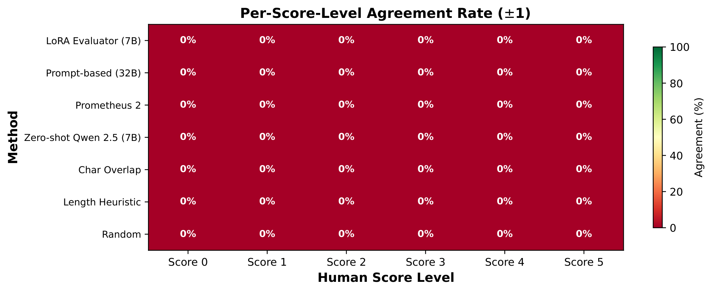
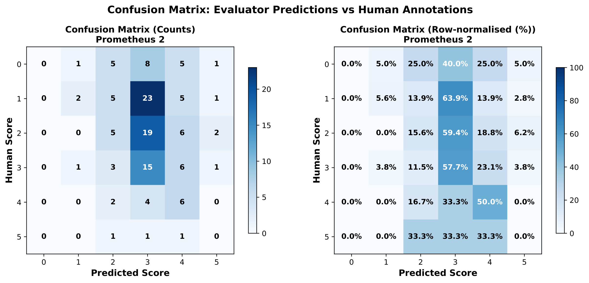
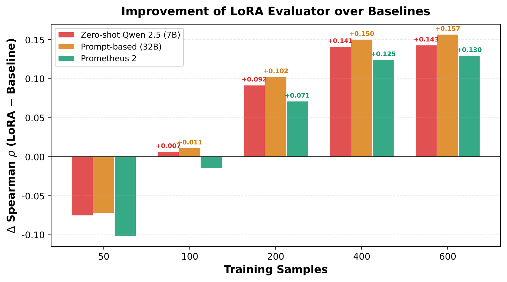
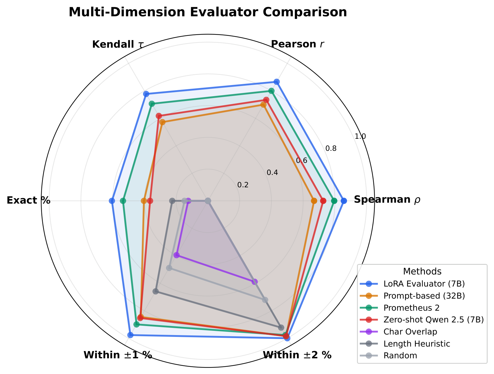
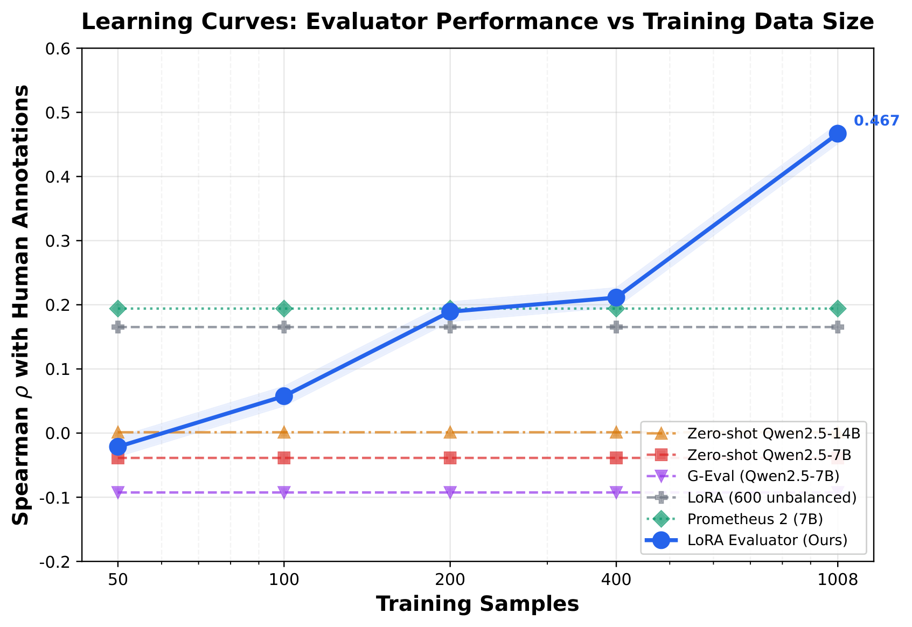
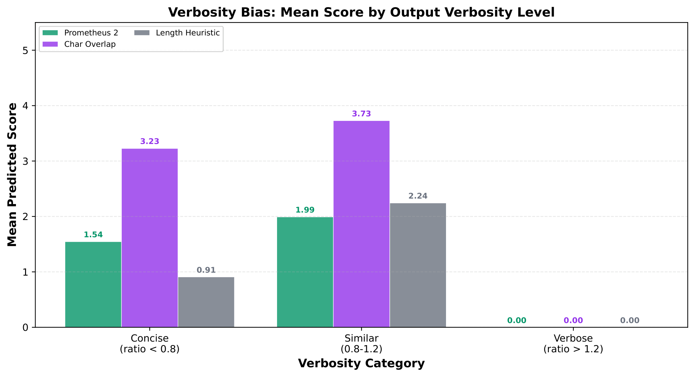
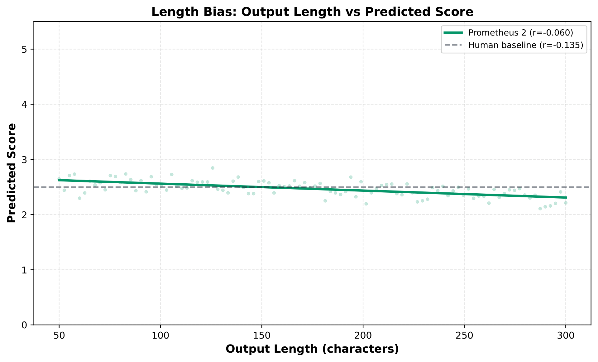
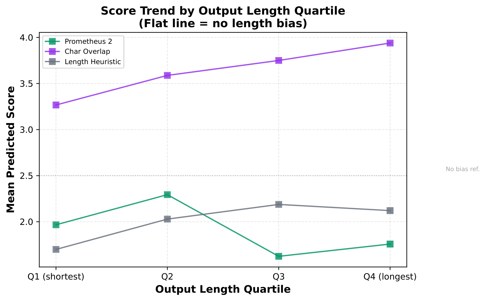

<h1 align="center">RewritingBench</h1>
<h3 align="center">A Diagnostic Benchmark for Chinese Text Rewriting Evaluation</h3>
<p align="center"><em>EMNLP 2026</em></p>
<p align="center">
  <a href="https://huggingface.co/datasets/heihei/llm-rewrite"></a>
  
  
</p>

---

## Overview

> Evaluating the quality of text rewriting remains a significant challenge, particularly for Chinese, where no validated benchmark exists.
> We present **RewritingBench**, the first human-annotated benchmark for Chinese text rewriting quality evaluation, comprising **730 rewrite pairs** scored by three annotators (inter-annotator Spearman &rho;&approx;0.86).
>
> Through systematic diagnostic analysis, we reveal a surprising finding: **all standard evaluation metrics exhibit *negative* correlation with human judgments** (&rho; from -0.24 to -0.60).
> We trace this failure to a fundamental misalignment: overlap-based metrics measure how *similar* a rewrite is to its source, while human judgment evaluates how *good* the rewrite is.
>
> As a positive demonstration, a **LoRA fine-tuned 7B model** with pairwise preference learning achieves &rho;=0.665, outperforming zero-shot **72B models** (&rho;&le;0.406), absolute scoring (&rho;=0.467), and all general-purpose evaluators.

---

## Table of Contents

- [Benchmark Details](#benchmark-details)
- [Main Results](#main-results)
- [Why Traditional Metrics Fail](#why-traditional-metrics-fail)
- [Pairwise Preference Evaluation](#pairwise-preference-evaluation)
- [Ablation Studies](#ablation-studies)
- [Bias Analysis](#bias-analysis)
- [Downstream Validation](#downstream-validation)
- [Quick Start](#quick-start)
- [Repo Structure](#repo-structure)
- [Citation](#citation)

---

## Benchmark Details

| Property | Value |
|----------|-------|
| **Total pairs** | 730 Chinese rewrite pairs |
| **Annotators** | 3 trained annotators, independent |
| **Scale** | 0--5 integer (holistic quality) |
| **Inter-annotator agreement** | Spearman &rho; &approx; 0.86 |
| **Train / Eval split** | 600 / 129 (stratified by score) |
| **Score distribution** | 0(15%), 1(28%), 2(25%), 3(20%), 4(10%), 5(3%) |

<p align="center"><br><em>Distribution of human annotations and RewriteJudge predictions. Balanced training aligns the predicted distribution with human scores.</em></p>

### Evaluation Dimensions

Quality is defined along four complementary dimensions:

1. **Semantic consistency** (&#35821;&#20041;&#19968;&#33268;&#24615;): Preserve core meaning without factual errors
2. **Syntactic reconstruction** (&#21477;&#27861;&#37325;&#26500;): Structural changes, not mere word substitution
3. **Lexical variation** (&#35789;&#27719;&#22810;&#26679;&#24615;): Different vocabulary while maintaining naturalness
4. **Stylistic fidelity** (&#39118;&#26684;&#24544;&#23454;&#24230;): Adhere to target style specifications

### Inter-Annotator Agreement

<p align="center"><br><em>Pairwise Spearman correlation between human annotators and evaluator methods. Human&ndash;human agreement (&sim;0.86) provides an approximate upper bound.</em></p>

### Confusion Matrices

<table align="center">
<tr>
<td align="center"><br><em>RewriteJudge: dispersed predictions across score range</em></td>
<td align="center"><br><em>Prometheus 2: predictions concentrated around score 1&ndash;2</em></td>
</tr>
</table>

---

## Main Results

<p align="center"><br><em>Spearman &rho; comparison across all evaluation methods. RewriteJudge (ours) substantially outperforms all baselines.</em></p>

### Absolute Scoring (Table 1)

| Method | Type | Spearman &rho; | Pearson *r* | Kendall &tau; | MAE | Exact/&plusmn;1/&plusmn;2 (%) |
|--------|:----:|:--------------:|:-----------:|:-------------:|:---:|:----------------------------:|
| **RewriteJudge (Ours)** | **Fine-tuned 7B** | **+0.467** | **+0.455** | **+0.365** | **1.16** | 29.5/69.0/89.1 |
| + Reasoning prefix | Fine-tuned 7B | +0.358 | +0.345 | +0.298 | 1.26 | 24.8/62.0/86.8 |
| Unbalanced training | Fine-tuned 7B | +0.165 | +0.124 | +0.138 | 1.21 | 24.0/69.8/88.4 |
| Prometheus 2 | Fine-tuned 7B | +0.124 | +0.111 | +0.103 | 1.50 | 21.7/51.9/82.2 |
| Zero-shot Qwen2.5-14B | Zero-shot 14B | +0.071 | +0.076 | +0.060 | 2.08 | 12.1/33.6/59.8 |
| Zero-shot Qwen2.5-7B | Zero-shot 7B | &minus;0.039 | +0.063 | &minus;0.032 | 2.03 | 11.6/38.0/60.5 |
| G-Eval (Qwen2.5-7B) | Zero-shot 7B | &minus;0.093 | &minus;0.012 | &minus;0.078 | 2.18 | 14.0/31.8/58.9 |
| W2V-COSINE | Traditional | &minus;0.285 | &minus;0.077 | &minus;0.210 | &mdash; | &mdash; |
| BLEU | Traditional | &minus;0.294 | &minus;0.211 | &minus;0.243 | &mdash; | &mdash; |
| SBERT-COSINE | Traditional | &minus;0.377 | &minus;0.056 | &minus;0.277 | &mdash; | &mdash; |
| ROUGE-L | Traditional | &minus;0.385 | &minus;0.396 | &minus;0.317 | &mdash; | &mdash; |
| JACCARD-WORD | Traditional | &minus;0.538 | &minus;0.509 | &minus;0.416 | &mdash; | &mdash; |
| TFIDF-COSINE | Traditional | &minus;0.571 | &minus;0.503 | &minus;0.433 | &mdash; | &mdash; |
| JACCARD-CHAR | Traditional | &minus;0.595 | &minus;0.550 | &minus;0.453 | &mdash; | &mdash; |

**Key takeaways:**

- **Traditional metrics fail**: All 7 metrics show statistically significant *negative* correlation (all *p* < 0.001). Higher metric scores correspond to *worse* human-rated rewrites.
- **General-purpose evaluators underperform**: Prometheus 2 (&rho;=0.124), G-Eval (&rho;=&minus;0.093) &mdash; neither can overcome domain-specific challenges.
- **Class balancing is critical**: Balanced training (1,008 samples) achieves &rho;=0.467 vs unbalanced (600 samples) at &rho;=0.165 (82% mode collapse).
- **Simple format beats reasoning**: Direct score prediction (&rho;=0.467) outperforms chain-of-thought reasoning prefix (&rho;=0.358).

---

## Why Traditional Metrics Fail

We identify **two systematic error patterns** that explain the universal negative correlation:

### Pattern 1: Surface Similarity Without Quality

Rewrites that are near-copies of the source &mdash; changing only a few words &mdash; receive **high metric scores** but **low human ratings**.

> Example: A rewrite that substitutes "&#21152;&#30431;" with "&#21152;&#30431;&#21518;" achieves BLEU=0.55 but receives a human score of only **0.7**.

### Pattern 2: Quality Without Surface Similarity

High-quality rewrites that substantially restructure the sentence receive **near-zero metric scores** but **high human ratings**.

> Example: A rewrite that restructures a passage into a more concise summary achieves BLEU=0.00 but receives a human score of **4.0**.

### Root Cause

<p align="center"><br><em>Per-method improvement analysis across score ranges.</em></p>

> **Fundamental misalignment**: Overlap-based metrics measure how *similar* a rewrite is to its source, while human judgment evaluates how *good* the rewrite is. For rewriting &mdash; where the goal is *transformation*, not reproduction &mdash; these objectives are **inversely correlated**.

This generalizes beyond Chinese: any evaluation scenario where good outputs should *differ* from inputs will face the same challenge.

---

## Pairwise Preference Evaluation

<p align="center"><br><em>Radar comparison of evaluation paradigms.</em></p>

### Method

Instead of assigning an absolute score, we train the model to predict **which of two rewrites is better**. From 600 training samples, we construct **2,652 cross-source pairwise comparisons** with balanced labels. At inference, we evaluate all C(129,2) = 8,256 pairs and compute each rewrite's **win rate**.

### Pairwise vs. Absolute (Table 4)

| Method | Training Data | Spearman &rho; |
|--------|:------------:|:--------------:|
| **Pairwise (cross-source)** | **2,652 pairs** | **+0.665** |
| Pairwise (generated) | 1,200 pairs | +0.421 |
| Absolute scoring (balanced) | 1,008 samples | +0.467 |
| Absolute scoring (original) | 600 samples | +0.165 |
| Qwen2.5-72B (zero-shot) | &mdash; | +0.406 |
| DeepSeek-V3 (zero-shot) | &mdash; | +0.391 |
| Prometheus 2 (7B) | &mdash; | +0.124 |
| G-Eval (7B) | &mdash; | &minus;0.093 |

**A 7B fine-tuned model outperforms a zero-shot 72B model by 64%.**

### Why Pairwise Wins

1. **Easier learning signal**: The model only needs to detect relative differences, not learn the full 0&ndash;5 score distribution.
2. **Robust aggregation**: Each rewrite's quality is informed by multiple comparisons (win rate), reducing noise from any single prediction.

---

## Ablation Studies

### Learning Curves

<p align="center">&nbsp;&nbsp;&nbsp;<br><em>Left: LoRA learning curve. Right: Full comparison including baselines (dashed lines).</em></p>

| Training Samples | Spearman &rho; |
|:----------------:|:--------------:|
| 50 | &minus;0.021 |
| 100 | +0.058 |
| 200 | +0.189 |
| 400 | +0.211 |
| **1,008** | **+0.467** |

Even with only 200 balanced samples, the model already beats all zero-shot and general-purpose evaluators. The sharp jump at 1,008 shows that sufficient examples per class (168/class) is essential.

### LoRA Rank Ablation (Pairwise)

| Rank *r* | &alpha; | Trainable Params | Spearman &rho; |
|:--------:|:-------:|:----------------:|:--------------:|
| 8 | 16 | &sim;0.1% | +0.685 |
| 16 | 32 | &sim;0.2% | +0.665 |
| **32** | **64** | **&sim;0.4%** | **+0.705** |

Performance scales modestly with rank. Even r=8 (80MB adapter) achieves &rho;=0.685 &mdash; pairwise learning is not highly sensitive to model capacity.

### Data Efficiency (Pairwise)

| Training Data | Pairs | Spearman &rho; | Accuracy |
|:-------------:|:-----:|:--------------:|:--------:|
| 25% | 663 | +0.434 | 81.0% |
| 50% | 1,326 | +0.140 | 99.2% |
| **100%** | **2,652** | **+0.665** | **90.0%** |

The 50% anomaly: high accuracy (99.2%) but low correlation (0.140) reveals **position bias** &mdash; the model learned to always predict "the second rewrite wins." This is diagnosed by the accuracy&ndash;correlation paradox: 99.2% accuracy should not yield &rho;=0.140. Sufficient data (100%) prevents this shortcut.

---

## Bias Analysis

<p align="center">&nbsp;&nbsp;&nbsp;<br><em>Left: Radar chart comparing bias dimensions. Right: Verbosity bias comparison.</em></p>

| Method | Output Len. *r* | Input Len. *r* | Verbosity &rho; | Position *r* | Avg |
|--------|:--------------:|:--------------:|:---------------:|:------------:|:---:|
| **RewriteJudge** | **&minus;0.05** | **&minus;0.07** | **&minus;0.09** | **&minus;0.07** | **0.07** |
| Prometheus 2 | &minus;0.06 | &minus;0.07 | &minus;0.06 | +0.04 | 0.06 |
| Char Overlap | +0.27 | +0.19 | +0.21 | +0.20 | 0.22 |
| Length Heuristic | +0.23 | &minus;0.04 | +0.86 | +0.79 | 0.48 |

RewriteJudge shows **minimal bias** across all dimensions &mdash; length, verbosity, and position &mdash; comparable to Prometheus 2 while achieving **3.8&times; higher correlation**.

<p align="center">&nbsp;&nbsp;&nbsp;<br><em>Left: Score vs. output length scatter. Right: Mean score by length quartile. RewriteJudge is consistent; traditional metrics favor longer outputs.</em></p>

---

## Downstream Validation

To demonstrate practical value beyond correlation metrics, we apply RewriteJudge to filter a dataset of **900 generated rewrites** (300 source texts &times; 3 quality levels).

| Strategy | *N* | Mean Score | &sigma; | %&ge;3 |
|----------|:---:|:----------:|:-------:|:------:|
| Top 30% | 270 | **4.34** | 0.48 | 100.0 |
| &ge;4 threshold | 429 | 4.22 | 0.41 | 100.0 |
| **Top 50%** | **450** | **4.16** | 0.48 | **100.0** |
| BLEU mid-range | 65 | 4.02 | 1.02 | 92.3 |
| &ge;3 threshold | 588 | 3.89 | 0.64 | 100.0 |
| Random 50% | 450 | 2.99 | 1.49 | 68.2 |
| All (unfiltered) | 900 | 2.93 | 1.51 | 65.3 |
| Bottom 50% | 450 | 0.37 | 0.48 | 0.0 |

**Evaluator-guided top-50% filtering improves mean quality by 39%** (4.16 vs 2.99) with 100% of selected rewrites scoring &ge;3. Meanwhile, BLEU-based filtering can barely identify any high-quality rewrites (only 65 out of 900).

---

## Training Configuration

| Hyperparameter | Value |
|----------------|-------|
| Base model | Qwen2.5-7B-Instruct |
| Quantization | 4-bit NF4 (double quantization) |
| LoRA rank (*r*) | 16 |
| LoRA &alpha; | 32 |
| LoRA dropout | 0.05 |
| Target modules | q\_proj, k\_proj, v\_proj, o\_proj, gate\_proj, up\_proj, down\_proj (7) |
| Learning rate | 2&times;10<sup>&minus;4</sup> |
| LR scheduler | Cosine (warmup 3%) |
| Epochs | 3 |
| Batch size | 4 (grad accum: 4, effective: 16) |
| Precision | bf16 |
| Training samples | 1,008 (168 per class) / 2,652 (pairwise) |
| GPU | 1&times; 3090 Ti (24GB) |
| Training time | &sim;25 minutes |

---

## Quick Start

### Setup

```bash
pip install "transformers>=4.45,<4.50" "peft>=0.13,<0.15" "trl>=0.12,<0.15"
```

### Download Data

```python
from datasets import load_dataset
dataset = load_dataset("heihei/llm-rewrite")
```

### Train RewriteJudge (Absolute Scoring)

```bash
python evaluator/train_lora.py \
  --data_path data/human_eval/train_score_only_balanced.json \
  --output_dir evaluator/checkpoints/balanced_simple \
  --base_model Qwen/Qwen2.5-7B-Instruct
```

### Train Pairwise Evaluator

```bash
python evaluator/train_lora.py \
  --data_path data/pairwise/cross_source_train.json \
  --output_dir evaluator/checkpoints/pairwise_b1_cross_source \
  --base_model Qwen/Qwen2.5-7B-Instruct \
  --task pairwise
```

### Run All Baselines

```bash
bash scripts/run_all.sh
```

---

## Repo Structure

```
├── paper/                    # Paper (LaTeX + PDF)
│   ├── main.tex              # Main paper source
│   ├── main.pdf              # Compiled paper
│   ├── refs.bib              # Bibliography
│   └── figures/              # All paper figures (PDF)
├── assets/                   # README figures (PNG)
├── evaluator/                # LoRA training & evaluation
│   ├── train_lora.py         # Fine-tuning script
│   ├── eval_evaluator.py     # Absolute scoring evaluation
│   ├── eval_pairwise.py      # Pairwise evaluation
│   ├── eval_api_pairwise.py  # API baseline evaluation (Qwen72B, DeepSeek)
│   ├── prompts.py            # Prompt templates
│   └── config.yaml           # Configuration
├── baselines/                # All baseline evaluators
│   ├── run_traditional.py    # BLEU, ROUGE, SBERT, etc.
│   ├── run_llm_evaluators.py # Zero-shot LLM eval
│   ├── run_prometheus2.py    # Prometheus 2 eval
│   ├── run_parascore.py      # ParaScore eval
│   ├── run_qwen32b_eval.py   # Qwen32B eval
│   └── correlation_utils.py  # Correlation computation utilities
├── analysis/                 # Correlation, bias, error analysis
│   ├── correlation_analysis.py
│   ├── bias_analysis.py
│   ├── error_analysis.py
│   ├── generate_figures.py   # All figure generation
│   ├── learning_curves.py
│   └── results/              # Analysis outputs + LaTeX tables
├── downstream/               # Downstream validation pipeline
│   ├── generate_data.py      # Generate rewrites (API)
│   ├── generate_data_local.py # Generate rewrites (local)
│   ├── score_rewrites.py     # Score with evaluator
│   ├── filter_data.py        # Filter by quality
│   ├── train_sft.py          # SFT training
│   └── eval_downstream.py    # Evaluation
└── scripts/                  # Data prep and run scripts
    ├── create_balanced_data.py
    ├── create_pairwise_data.py
    ├── create_pairwise_subsets.py
    ├── convert_data.py
    ├── consolidate_results.py
    ├── run_all.sh
    ├── run_all_pairwise_experiments.sh
    ├── run_baselines.sh
    ├── run_downstream.sh
    └── run_evaluator_training.sh
```

---

## Dataset

All training and evaluation data is available on HuggingFace:

**[heihei/llm-rewrite](https://huggingface.co/datasets/heihei/llm-rewrite)**

| Split | Description | Size |
|-------|-------------|------|
| `human_eval/full.json` | 730 annotated pairs (3 annotators, 0&ndash;5) | 537K |
| `human_eval/train.json` | 600 training samples | 441K |
| `human_eval/eval.json` | 129 evaluation samples | 95K |
| `human_eval/train_score_only_balanced.json` | 1,008 class-balanced training | 1.6M |
| `pairwise/cross_source_train.json` | 2,652 cross-source pairs | 4.5M |
| `pairwise/cross_source_train_25pct.json` | 25% subset (663 pairs) | 1.1M |
| `pairwise/cross_source_train_50pct.json` | 50% subset (1,326 pairs) | 2.3M |
| `baselines/all_results.json` | Consolidated predictions from 16 methods | 12K |
| `baselines/method_metadata.json` | Method display names and metadata | 4.5K |
| `generated_rewrites/scored_rewrites.json` | 900 scored rewrites (downstream) | 710K |
| `analysis/correlation_results.json` | Full correlation analysis | 49K |

---

## Citation

```bibtex
@inproceedings{rewritingbench2026,
  title     = {RewritingBench: A Diagnostic Benchmark for Chinese Text Rewriting Evaluation},
  booktitle = {Proceedings of the 2026 Conference on Empirical Methods in Natural Language Processing},
  year      = {2026}
}
```

---

## License

- **Code**: MIT
- **Dataset**: [CC-BY-4.0](https://creativecommons.org/licenses/by/4.0/)
- **Paper**: See `paper/`
