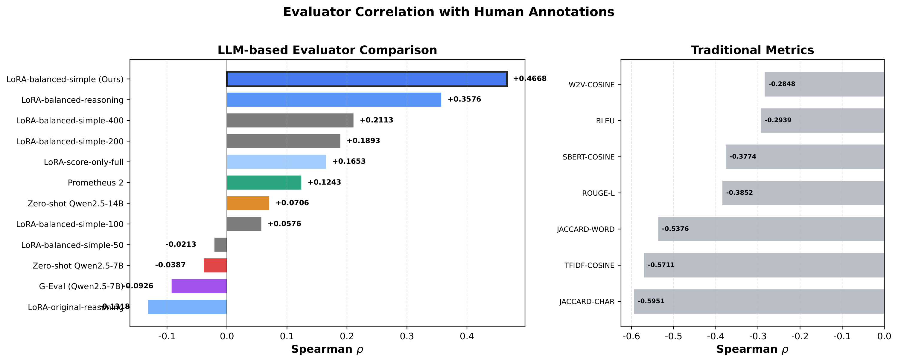
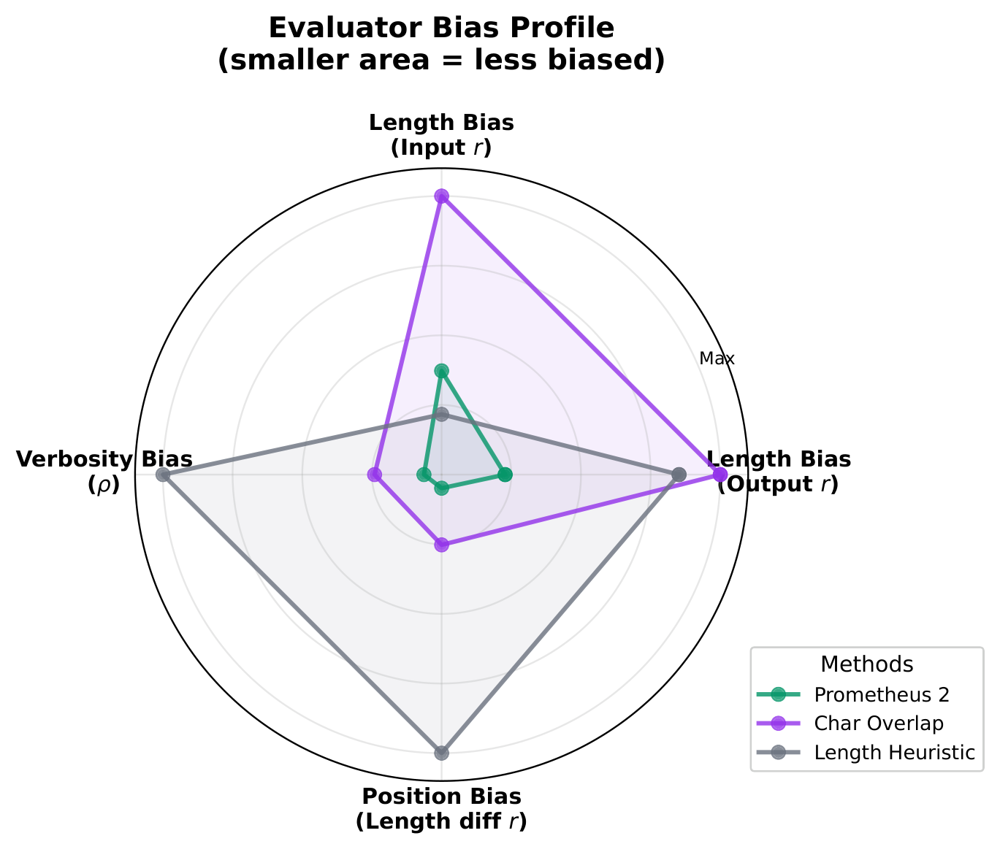
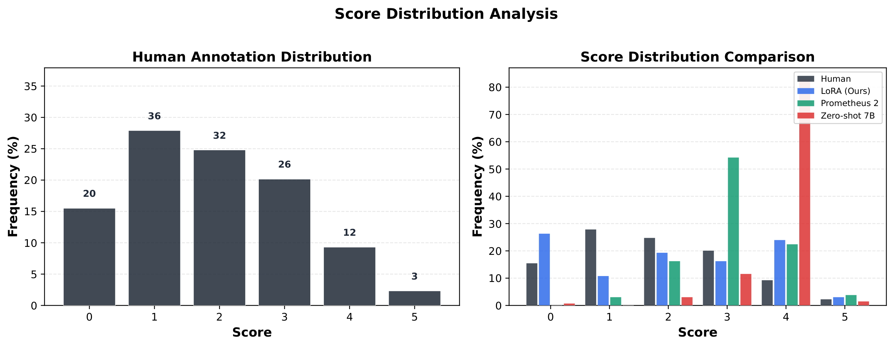
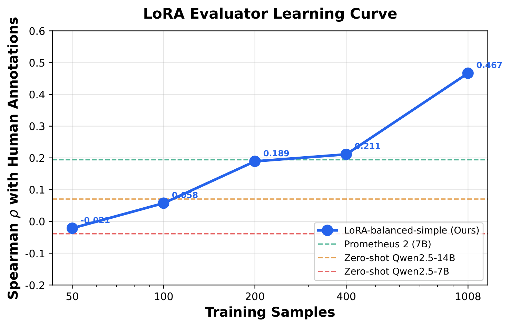
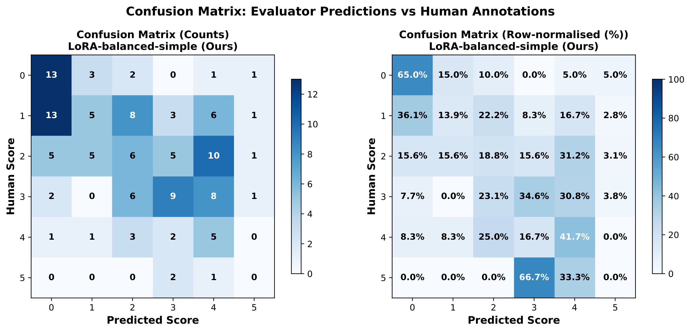

<h1 align="center">RewritingBench</h1>
<h3 align="center">A Diagnostic Benchmark for Chinese Text Rewriting Evaluation</h3>
<p align="center">
  <em>EMNLP 2026</em>
</p>
<p align="center">
  <a href="https://huggingface.co/datasets/heihei/llm-rewrite">
    
  </a>
  
  
</p>

---

## TL;DR

**All standard metrics (BLEU, ROUGE, BERTScore...) show *negative* correlation with human judgments on Chinese text rewriting.** We build RewritingBench, the first benchmark for this task, and show that pairwise preference learning with a 7B LoRA model ($\rho$=0.665) far outperforms 72B zero-shot models ($\rho$=0.406).

---

## Key Findings

### 1. Traditional Metrics Fail Completely

All 7 traditional metrics exhibit **negative** correlation with human judgments (Spearman $\rho$ from -0.24 to -0.60). This happens because overlap-based metrics reward similarity to the source text, but a *good* rewrite should *differ* from the source.

| Metric | Spearman $\rho$ |
|--------|:--------------:|
| JACCARD-CHAR | **-0.595** |
| TFIDF-COSINE | -0.571 |
| JACCARD-WORD | -0.538 |
| ROUGE-L | -0.385 |
| SBERT-COSINE | -0.377 |
| BLEU | -0.294 |
| W2V-COSINE | -0.285 |

### 2. Pairwise Preference Learning Beats Everything

<p align="center">
  
</p>

Our pairwise LoRA model (7B, trained on 2,652 pairs) achieves $\rho$=0.665, outperforming:

| Method | Size | Spearman $\rho$ |
|--------|:----:|:---------------:|
| **Pairwise LoRA (Ours)** | **7B** | **+0.665** |
| Absolute LoRA (Ours) | 7B | +0.467 |
| Qwen2.5-72B (zero-shot) | 72B | +0.406 |
| DeepSeek-V3 (zero-shot) | — | +0.391 |
| Prometheus 2 | 7B | +0.124 |
| Zero-shot Qwen2.5-7B | 7B | -0.039 |
| G-Eval | 7B | -0.093 |

A 7B fine-tuned model outperforms a zero-shot **72B** model by 64%.

### 3. Low Bias

<p align="center">
   &nbsp;&nbsp;
  
</p>

RewriteJudge shows minimal length bias, verbosity bias, and position bias, comparable to Prometheus 2 while achieving 3.8x higher correlation.

### 4. Learning Curves

<p align="center">
  
</p>

Even 200 balanced samples ($\rho$=0.189) beats all zero-shot and general-purpose evaluators. Performance scales monotonically with data.

### 5. Practical Impact: +39% Data Quality

Evaluator-guided filtering on 900 generated rewrites:

| Strategy | Mean Score | %≥3 |
|----------|:----------:|:---:|
| Top 50% (ours) | **4.16** | **100%** |
| Random 50% | 2.99 | 68.2% |

---

## Benchmark Details

- **730** Chinese rewrite pairs, scored by 3 annotators (0--5 scale)
- Inter-annotator agreement: Spearman $\rho \approx 0.86$
- Split: 600 train / 129 eval (stratified by score)
- Score distribution: 0(15%), 1(28%), 2(25%), 3(20%), 4(10%), 5(3%)

<p align="center">
  
</p>

---

## Repo Structure

```
├── paper/                  # Paper (LaTeX + PDF)
│   ├── main.tex
│   ├── main.pdf
│   ├── refs.bib
│   └── figures/            # All paper figures
├── evaluator/              # LoRA training & evaluation
│   ├── train_lora.py       # Fine-tuning script
│   ├── eval_evaluator.py   # Absolute scoring evaluation
│   ├── eval_pairwise.py    # Pairwise evaluation
│   ├── eval_api_pairwise.py # API baseline evaluation
│   └── prompts.py          # Prompt templates
├── baselines/              # All baseline evaluators
│   ├── run_traditional.py  # BLEU, ROUGE, SBERT, etc.
│   ├── run_llm_evaluators.py # Zero-shot LLM eval
│   ├── run_prometheus2.py  # Prometheus 2 eval
│   └── run_parascore.py    # ParaScore eval
├── analysis/               # Correlation, bias, error analysis
│   ├── correlation_analysis.py
│   ├── bias_analysis.py
│   ├── error_analysis.py
│   ├── generate_figures.py
│   └── results/            # Analysis outputs + LaTeX tables
├── downstream/             # Downstream validation pipeline
│   ├── generate_data.py
│   ├── filter_data.py
│   └── eval_downstream.py
└── scripts/                # Data prep and run scripts
    ├── create_balanced_data.py
    ├── create_pairwise_data.py
    └── run_all.sh
```

---

## Quick Start

### Setup

```bash
pip install transformers>=4.45,<4.50 peft>=0.13,<0.15 trl>=0.12,<0.15
```

### Train RewriteJudge (Absolute Scoring)

```bash
python evaluator/train_lora.py \
  --data_path data/human_eval/train_score_only_balanced.json \
  --output_dir evaluator/checkpoints/balanced_simple \
  --base_model Qwen/Qwen2.5-7B-Instruct
```

### Train Pairwise Evaluator

```bash
python evaluator/train_lora.py \
  --data_path data/pairwise/cross_source_train.json \
  --output_dir evaluator/checkpoints/pairwise_b1_cross_source \
  --base_model Qwen/Qwen2.5-7B-Instruct \
  --task pairwise
```

### Run All Baselines

```bash
bash scripts/run_all.sh
```

---

## Dataset

All training and evaluation data is available on HuggingFace:

**[heihei/llm-rewrite](https://huggingface.co/datasets/heihei/llm-rewrite)**

Contains:
- 730 human-annotated Chinese rewrite pairs (3 annotators, 0--5 scale)
- 2,652 pairwise training comparisons
- Baseline evaluation results from 16 methods
- 900 generated rewrites for downstream validation

---

## Citation

```bibtex
@inproceedings{rewritingbench2026,
  title     = {RewritingBench: A Diagnostic Benchmark for Chinese Text Rewriting Evaluation},
  booktitle = {Proceedings of the 2026 Conference on Empirical Methods in Natural Language Processing},
  year      = {2026}
}
```

---

## License

- Code: MIT
- Dataset: CC-BY-4.0
- Paper: See `paper/`
