<h1 align="center">RewriteJudge</h1>
<h3 align="center">From Absolute Scores to Pairwise Preferences: Training LLM Judges for Chinese Text Rewriting Evaluation</h3>
<p align="center"><em>EMNLP 2026</em></p>
<p align="center">
  <a href="https://huggingface.co/datasets/heihei/llm-rewrite"></a>
  
  
</p>

---

## Overview

> Evaluating Chinese text rewriting is inherently subjective: a good rewrite must preserve meaning while improving expression, and annotators often make relative rather than calibrated absolute judgments.
> We compare **absolute-score SFT** with **pairwise preference training** for Chinese rewrite quality evaluation.
>
> Using 730 human-rated Chinese source–rewrite pairs from three trained annotators (ICC(2,1) = 0.87), we show that:
> - **Pairwise preference training** achieves ρ = 0.688, outperforming absolute-score SFT (ρ = 0.645) and substantially exceeding zero-shot and general-purpose LLM judges.
> - A **7B/8B LoRA model** trained with pairwise supervision outperforms zero-shot models up to **685B parameters**.
> - All source-similarity metrics (BLEU, ROUGE, SBERT, etc.) show **negative correlation** with human judgments (ρ from −0.28 to −0.60), confirming that rewrite evaluation requires learning human preferences rather than measuring source overlap.

<p align="center">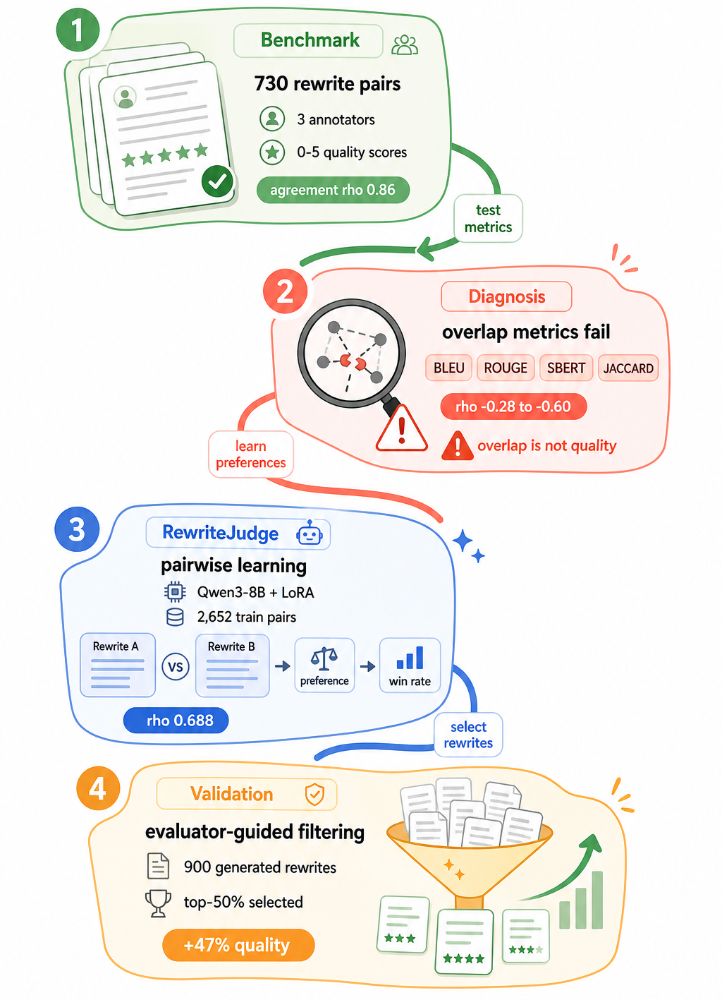<br><em>Framework overview: collect human-rated Chinese rewrite pairs, construct preference supervision, and train RewriteJudge via contrastive learning with win-rate aggregation.</em></p>

---

## Table of Contents

- [Key Results](#key-results)
- [Pairwise vs. Absolute Scoring](#pairwise-vs-absolute-scoring)
- [Why Traditional Metrics Fail](#why-traditional-metrics-fail)
- [Data Efficiency & Robustness](#data-efficiency--robustness)
- [Bias Analysis](#bias-analysis)
- [Quick Start](#quick-start)
- [Repo Structure](#repo-structure)
- [Citation](#citation)

---

## Key Results

### Main Comparison (Pairwise vs. Absolute SFT)

| Method | Model | Supervision | Spearman ρ |
|--------|:-----:|:-----------:|:----------:|
| **Pairwise (ours)** | **Qwen3 8B** | **Cross-source pref.** | **+0.688** |
| Pairwise (ours) | Qwen2.5 7B | Cross-source pref. | +0.665 |
| Absolute SFT (ours) | Qwen3 8B | Score regression | +0.645 |
| Absolute SFT (ours) | Qwen2.5 7B | Score regression | +0.580 |
| Zero-shot | Qwen2.5 72B | None | +0.406 |
| Zero-shot | DeepSeek V3 | None | +0.391 |
| Gen. purpose | Prometheus 2 | Multi-task | +0.145 |
| Zero-shot | Qwen3 8B | None | +0.106 |

**Pairwise preference training consistently outperforms absolute-score SFT** across both backbone models, and our 8B LoRA model outperforms all zero-shot baselines up to 685B parameters.

### Full Baseline Results

<p align="center">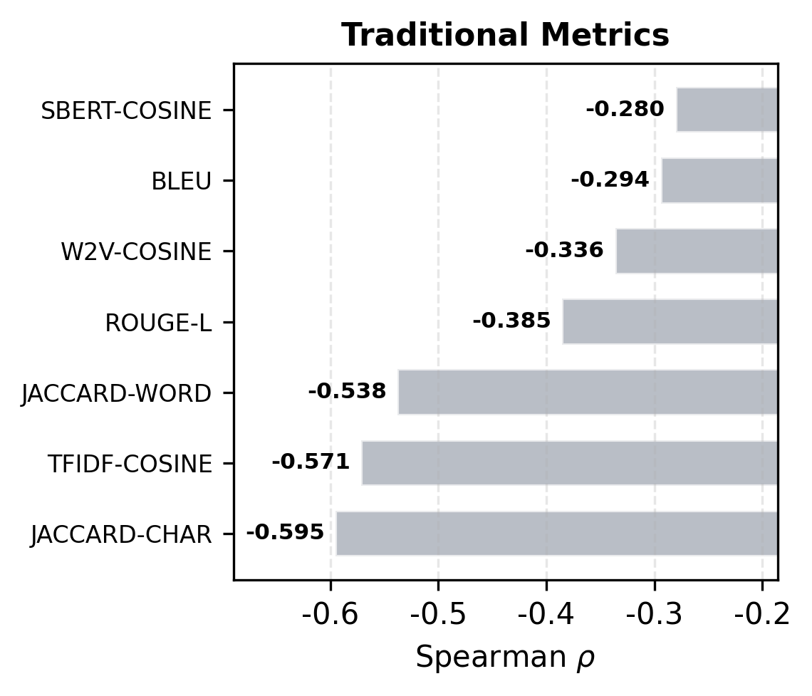<br><em>All seven source-similarity metrics are negatively correlated with human rewrite quality (bootstrap 95% CIs do not cross zero).</em></p>

---

## Pairwise vs. Absolute Scoring

<p align="center">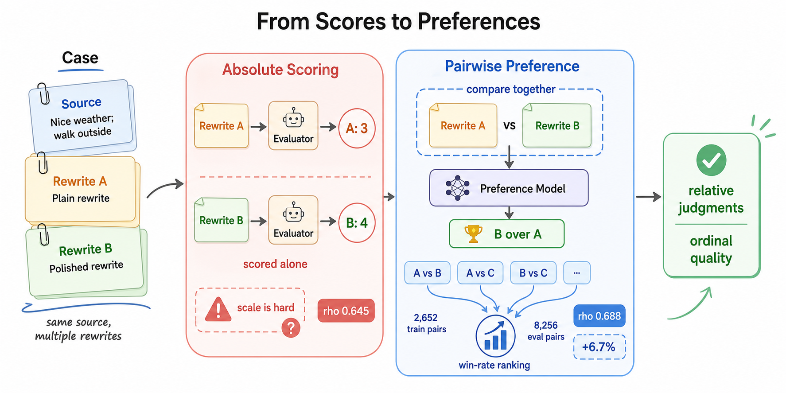<br><em>Absolute scoring requires global score calibration across all quality levels; pairwise training learns relative preference and aggregates comparisons into rankings via win rates.</em></p>

### Why Pairwise Wins

1. **Easier learning signal**: The model only needs to detect relative differences, not learn the full 0–5 score distribution.
2. **Robust aggregation**: Each rewrite's quality is informed by multiple comparisons (win rate), reducing noise from any single prediction.
3. **Data-efficient**: Qwen3 8B reaches ρ = 0.611 with only 25% of training data (663 pairs).

### Accuracy vs. Ranking Correlation Paradox

<p align="center">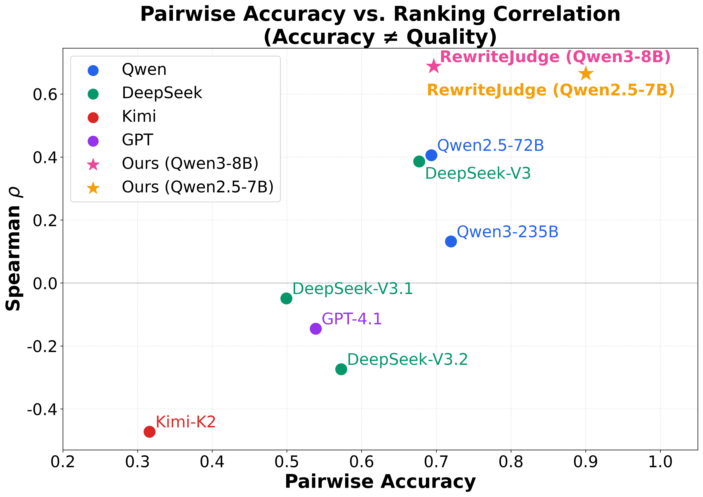<br><em>Pairwise accuracy is a misleading metric for zero-shot evaluators. Qwen3-235B achieves 72.0% accuracy yet only ρ=0.132.</em></p>

---

## Why Traditional Metrics Fail

All seven source-similarity metrics show **statistically significant negative correlation** with human judgments:

| Metric | Spearman ρ | Error Mode |
|--------|:----------:|:----------:|
| JACCARD-CHAR | −0.595 | Rewards copying, penalizes transformation |
| TFIDF-COSINE | −0.571 | Rewards copying, penalizes transformation |
| JACCARD-WORD | −0.538 | Rewards copying, penalizes transformation |
| ROUGE-L | −0.385 | Rewards copying, penalizes transformation |
| SBERT-COSINE | −0.280 | Rewards copying, penalizes transformation |
| BLEU | −0.294 | Rewards copying, penalizes transformation |
| W2V-COSINE | −0.336 | Rewards copying, penalizes transformation |

**Root cause**: Overlap-based metrics measure how *similar* a rewrite is to its source, while human judgment evaluates how *good* the rewrite is. For rewriting — where the goal is *transformation*, not reproduction — these objectives are **inversely correlated**.

---

## Data Efficiency & Robustness

### Pairwise Data Efficiency

| Model | Training Data | Pairs | Spearman ρ |
|:-----:|:-------------:|:-----:|:----------:|
| Qwen2.5 7B | 25% | 663 | +0.434 |
| Qwen2.5 7B | 50% | 1,326 | +0.140 |
| **Qwen2.5 7B** | **100%** | **2,652** | **+0.665** |
| Qwen3 8B | 25% | 663 | +0.611 |
| Qwen3 8B | 50% | 1,326 | +0.669 |
| **Qwen3 8B** | **100%** | **2,652** | **+0.688** |

Qwen3 8B maintains stable performance with only 25% of data. The 50% anomaly for Qwen2.5 7B reveals **position bias** — the model learned to always predict "the second rewrite wins." Sufficient data (100%) prevents this shortcut.

### Absolute-Score Learning Curve

<p align="center">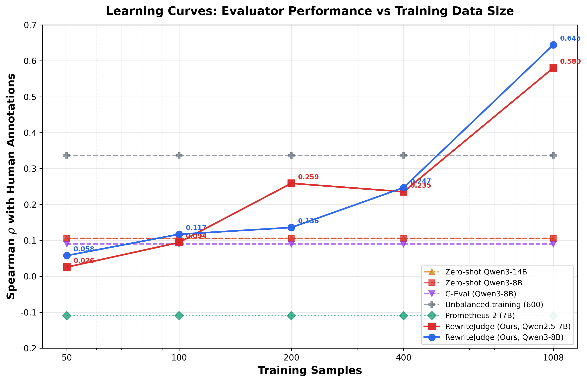<br><em>LoRA learning curve including both variants and baselines (dashed lines). All baselines show flat or negative correlation regardless of data size.</em></p>

| Balanced Samples | Qwen2.5 7B | Qwen3 8B |
|:----------------:|:----------:|:--------:|
| 50 | −0.026 | +0.058 |
| 100 | +0.094 | +0.117 |
| 200 | +0.259 | +0.136 |
| 400 | +0.235 | +0.247 |
| **1,008 (full)** | **+0.580** | **+0.645** |

Even at full data, absolute scoring remains below pairwise preference training (ρ = 0.645 vs. ρ = 0.688).

### LoRA Rank Ablation

| Model | Rank *r* | α | Params | Spearman ρ |
|:-----:|:--------:|:-:|:------:|:----------:|
| Qwen2.5 7B | 8 | 16 | ~0.1% | +0.685 |
| Qwen2.5 7B | 16 | 32 | ~0.2% | +0.665 |
| **Qwen2.5 7B** | **32** | **64** | **~0.4%** | **+0.705** |
| Qwen3 8B | 8 | 16 | ~0.1% | +0.679 |
| Qwen3 8B | 16 | 32 | ~0.2% | +0.688 |
| **Qwen3 8B** | **32** | **64** | **~0.4%** | **+0.713** |

Performance is not highly sensitive to adapter capacity. Even r = 8 (80MB adapter) achieves strong results.

---

## Bias Analysis

<p align="center">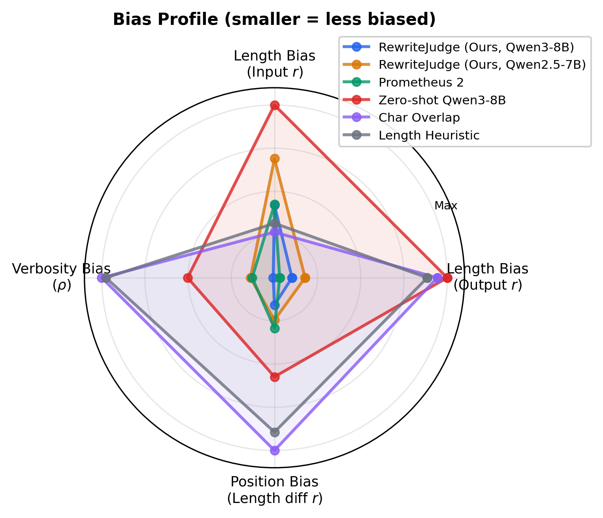&nbsp;&nbsp;&nbsp;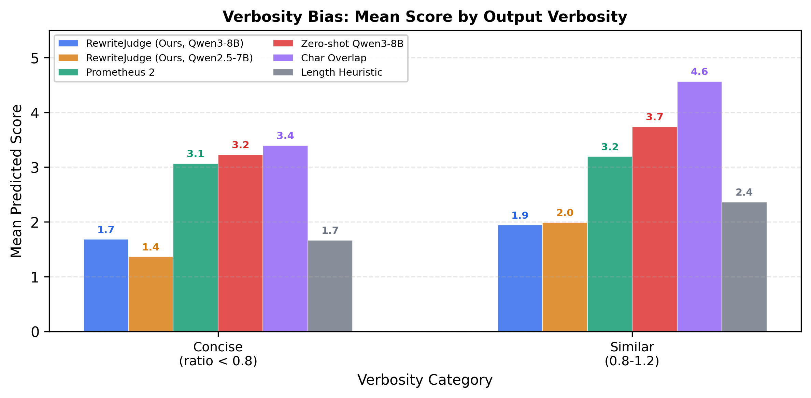<br><em>Left: Bias heatmap across evaluator methods. Right: Verbosity bias comparison. RewriteJudge shows minimal bias across all dimensions.</em></p>

| Method | Output Len. *r* | Verbosity ρ | Position *r* | Bias Score |
|--------|:--------------:|:-----------:|:------------:|:----------:|
| **RewriteJudge (Qwen3 8B)** | **−0.033** | **0.006** | **0.120** | **0.057** |
| RewriteJudge (Qwen2.5 7B) | −0.058 | 0.106 | 0.187 | 0.116 |
| Prometheus 2 | 0.010 | 0.098 | 0.223 | 0.100 |
| Zero-shot Qwen3 8B | 0.325 | 0.382 | 0.437 | 0.328 |
| Char Overlap | 0.306 | 0.760 | 0.762 | 0.468 |

RewriteJudge shows **minimal bias** across all dimensions — length, verbosity, and position — while achieving substantially higher correlation.

<p align="center">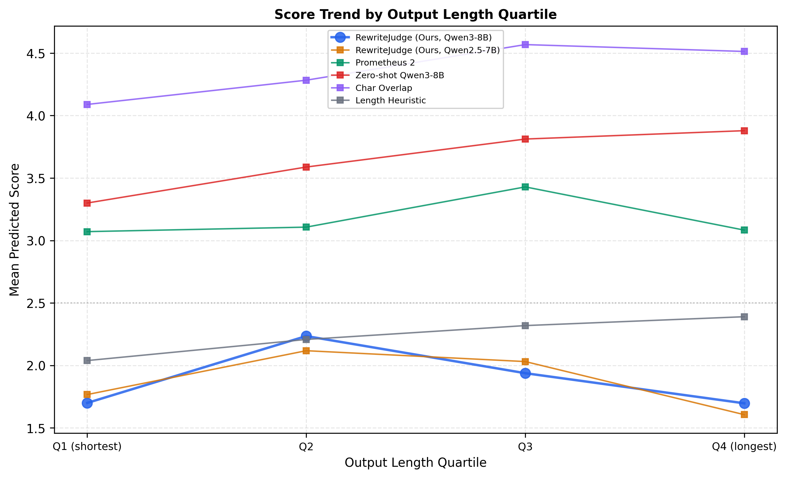<br><em>Mean score by output length quartile. RewriteJudge is consistent; traditional metrics favor longer outputs.</em></p>

### Calibration Analysis

<table align="center">
<tr>
<td align="center">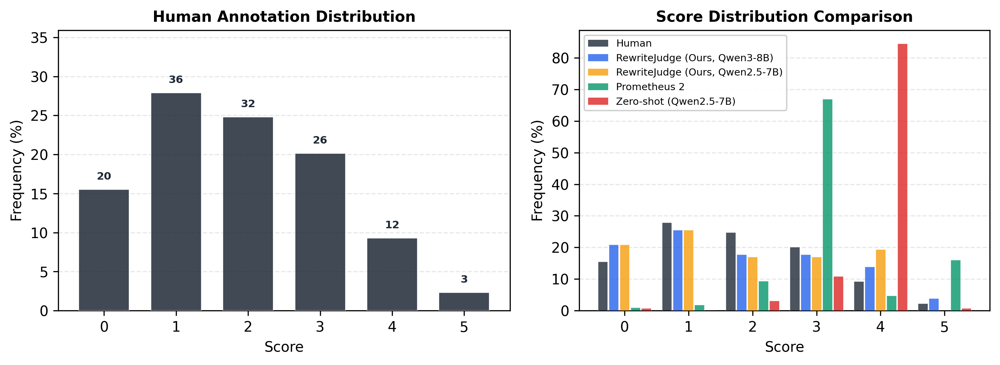<br><em>Score distribution: RewriteJudge predictions closely match human annotations</em></td>
</tr>
</table>

<table align="center">
<tr>
<td align="center">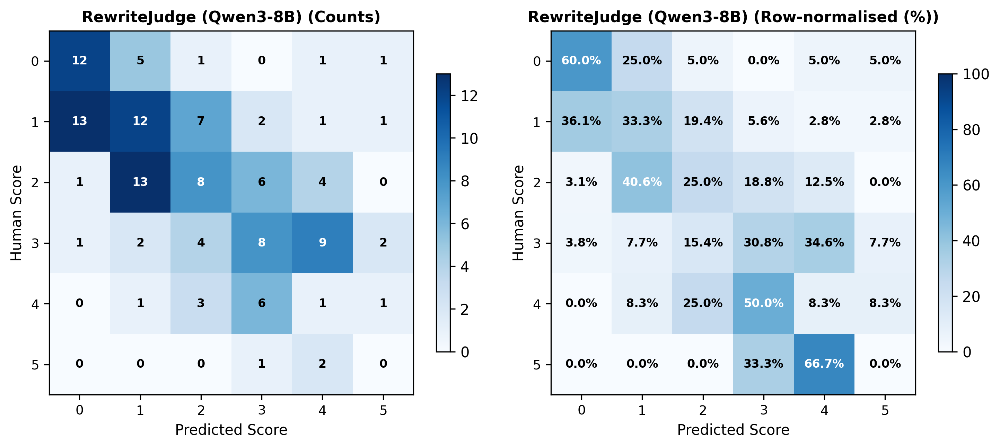<br><em>RewriteJudge (Qwen3 8B): strong diagonal trend</em></td>
<td align="center">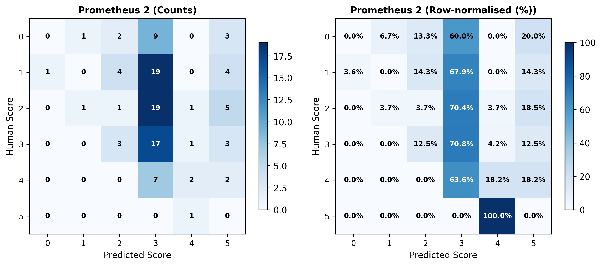<br><em>Prometheus 2: predictions concentrated around score 3</em></td>
</tr>
</table>

---

## Benchmark Details

| Property | Value |
|----------|-------|
| **Total pairs** | 730 Chinese rewrite pairs |
| **Annotators** | 3 trained annotators, independent |
| **Scale** | 0–5 integer (holistic quality) |
| **Inter-annotator agreement** | Spearman ρ ≈ 0.88, ICC(2,1) = 0.87 |
| **Train / Eval split** | 600 / 130 (stratified by score) |
| **Score distribution** | 0(15.5%), 1(27.9%), 2(24.8%), 3(20.2%), 4(9.3%), 5(2.3%) |
| **Balanced training** | 1,008 samples (168 per class, oversampled) |

### Evaluation Dimensions

Quality is defined along four complementary dimensions:

1. **Meaning preservation**: Preserve core meaning without factual errors
2. **Expression improvement**: Improve fluency, clarity, and readability
3. **Appropriate transformation**: Structural and phrasing changes, not mechanical substitution
4. **Naturalness and idiomaticity**: Natural, contextually appropriate Chinese expression

---

## Training Configuration

| Hyperparameter | Value |
|----------------|-------|
| Base models | Qwen3 8B, Qwen2.5 7B Instruct |
| Quantization | bf16 (no quantization) |
| LoRA rank (*r*) | 16 |
| LoRA α | 32 |
| LoRA dropout | 0.05 |
| Target modules | q\_proj, k\_proj, v\_proj, o\_proj, gate\_proj, up\_proj, down\_proj |
| Learning rate | 2×10⁻⁴ |
| LR scheduler | Cosine (warmup 3%) |
| Epochs | 3 |
| Batch size | 4 (grad accum: 4, effective: 16) |
| Precision | bf16 |
| Gradient checkpointing | Enabled |
| Training samples | 1,008 (absolute) / 2,652 pairs (pairwise) |
| GPU | 1× NVIDIA H20 (96GB) |
| Training time | ~16 minutes |

---

## Quick Start

### Setup

```bash
pip install "transformers>=4.45,<4.50" "peft>=0.13,<0.15" "trl>=0.12,<0.15"
```

### Download Data

```python
from datasets import load_dataset
dataset = load_dataset("heihei/llm-rewrite")
```

### Train RewriteJudge (Absolute Scoring)

```bash
python code/evaluator/train_lora.py \
  --data_path data/human_eval/train_score_only_detail_balanced.json \
  --output_dir code/evaluator/checkpoints/balanced_detailed \
  --base_model Qwen/Qwen3-8B
```

### Train Pairwise Evaluator

```bash
python code/evaluator/train_lora.py \
  --data_path data/pairwise/cross_source_train.json \
  --output_dir code/evaluator/checkpoints/pairwise_cross_source \
  --base_model Qwen/Qwen3-8B \
  --task pairwise
```

### Run All Baselines

```bash
bash code/scripts/run_all.sh
```

---

## Repo Structure

```
├── paper/                    # Paper (LaTeX + PDF)
│   ├── main.tex              # Main paper source
│   ├── main.pdf              # Compiled paper
│   ├── refs.bib              # Bibliography
│   └── figures/              # All paper figures (PDF + PNG)
│       └── ai_generated/     # Framework and paradigm overview diagrams
├── code/evaluator/           # LoRA training & evaluation
│   ├── train_lora.py         # Fine-tuning script
│   ├── eval_evaluator.py     # Absolute scoring evaluation
│   ├── eval_pairwise.py      # Pairwise evaluation
│   ├── eval_api_pairwise.py  # API baseline evaluation
│   ├── prompts.py            # Prompt templates
│   └── config.yaml           # Configuration
├── code/baselines/           # All baseline evaluators
│   ├── run_traditional.py    # BLEU, ROUGE, SBERT, etc.
│   ├── run_llm_evaluators.py # Zero-shot LLM eval
│   ├── run_prometheus2.py    # Prometheus 2 eval
│   ├── run_parascore.py      # ParaScore eval
│   ├── run_qwen32b_eval.py   # Qwen32B eval
│   └── correlation_utils.py  # Correlation computation utilities
├── code/analysis/            # Correlation, bias, error analysis
│   ├── correlation_analysis.py
│   ├── bias_analysis.py
│   ├── error_analysis.py
│   ├── generate_figures.py   # All figure generation
│   ├── learning_curves.py
│   ├── results/              # Analysis outputs + LaTeX tables
│   └── figures/              # Generated figures (PDF + PNG)
├── code/downstream/          # Downstream validation pipeline
│   ├── generate_data.py      # Generate rewrites (API)
│   ├── generate_data_local.py # Generate rewrites (local)
│   ├── score_rewrites.py     # Score with evaluator
│   ├── filter_data.py        # Filter by quality
│   ├── train_sft.py          # SFT training
│   └── eval_downstream.py    # Evaluation
└── code/scripts/             # Data prep and run scripts
    ├── create_balanced_data.py
    ├── create_pairwise_data.py
    ├── convert_data.py
    ├── consolidate_results.py
    ├── run_all.sh
    ├── run_all_pairwise_experiments.sh
    └── run_baselines.sh
```

---

## Dataset

All training and evaluation data is available on HuggingFace:

**[heihei/llm-rewrite](https://huggingface.co/datasets/heihei/llm-rewrite)**

| Split | Description | Size |
|-------|-------------|------|
| `human_eval/full.json` | 730 annotated pairs (3 annotators, 0–5) | 537K |
| `human_eval/train.json` | 600 training samples | 441K |
| `human_eval/eval.json` | 130 evaluation samples | 95K |
| `human_eval/train_score_only_detail_balanced.json` | 1,008 class-balanced training | 1.6M |
| `pairwise/cross_source_train.json` | 2,652 cross-source pairs | 4.5M |
| `baselines/all_results.json` | Consolidated predictions from 19 methods | 12K |

---

## Citation

```bibtex
@inproceedings{rewritejudge2026,
  title     = {From Absolute Scores to Pairwise Preferences: Training LLM Judges for Chinese Text Rewriting Evaluation},
  booktitle = {Proceedings of the 2026 Conference on Empirical Methods in Natural Language Processing},
  year      = {2026}
}
```

---

## License

- **Code**: MIT
- **Dataset**: [CC-BY-4.0](https://creativecommons.org/licenses/by/4.0/)
- **Paper**: See `paper/`
